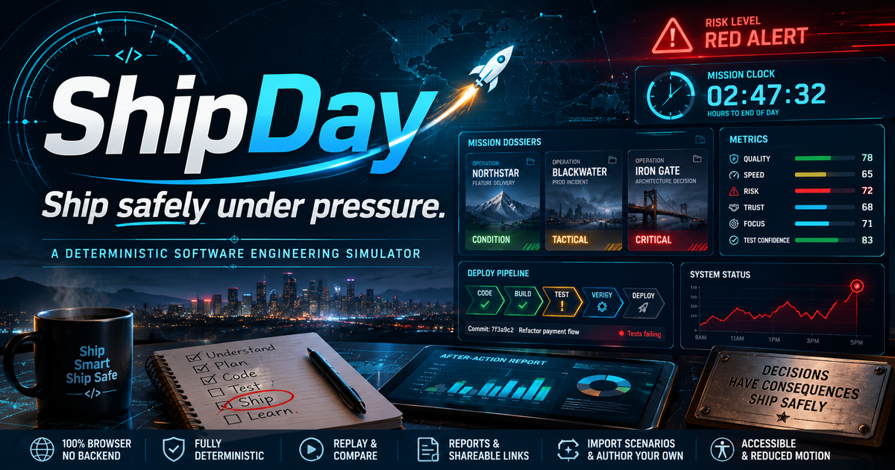

# ShipDay



A real-life software engineering simulator about shipping safely under pressure.

**[Live demo](https://shipday-topaz.vercel.app)** · No backend, no sign-in, runs entirely in the browser.

**Stack:** Next.js · React · TypeScript · Three.js · Tailwind CSS · zero backend, zero database, zero environment variables.

> **Engineering rigor.** ShipDay is built on a pure, deterministic engine, not a
> scripted game. `npm run verify` enumerates every possible run of every
> scenario — 24,832 in total — asserts each of the five outcomes is reachable
> within tuned distribution bounds, pins the exact distributions against
> regression, asserts the customer-impact curve is non-decreasing across the
> difficulty ramp, and proves replay and shareable-run-code reconstruction
> reproduce every run exactly. The spy-thriller presentation is a layer over an
> engine that is fully tested and reproducible.

Each scenario is one simulated workday: ambiguous requirements, failing
tests, a production page, stakeholder pressure, and a release decision at the
end. Every choice moves your metrics (quality, speed, risk, trust, focus,
test confidence), sets behavioral flags, and feeds a deterministic outcome.
Consequence text can react to what you did earlier in the day, so the same
choice reads differently after a careful morning than after a reckless one.
At the end of the day you get a report on how your choices added up, you can
replay the day decision by decision, download the report, compare two runs
side by side, and copy a link that rebuilds the whole run for anyone you send
it to. You can import a scenario as JSON and play it, or build one in the
authoring studio with live validation and a distribution preview.

The whole experience is framed as a spy-thriller agency operation wrapped
around the same engine. A cold open boots the agency on the first visit of a
session, the scenarios are a wall of classified mission dossiers, and starting
one plays a full mission briefing. A mission clock counts down to end of day,
and the interface responds to the risk metric at its real thresholds: below 40
it holds Condition green, past 40 the room goes tactical amber, past 65 it drops
into a red-alert takeover, and it stands down on its own when a later decision
pulls risk back. The final decision plays a resolution climax with a mission
verdict matched to the actual outcome, then the report presents as a classified
after-action file. The framing is presentation only: gameplay, metrics, and
outcomes are unchanged, and all of it respects reduced motion.

Fully deterministic. Runs entirely in the browser. No API calls, no backend,
no database, no environment variables.

## The experience

The presentation layer is information design: visual tension exists only where
simulation state justifies it, and it eases back when a decision lowers risk.
The spy-thriller framing (the `components/cinematic/` and `lib/cinematic/`
layers) is pure presentation over the unchanged engine. The full system is
documented in [docs/DESIGN.md](docs/DESIGN.md); in short:

- **Mission framing.** A cold open boots the agency over the already-rendered
  landing on the first visit of a session, the scenario picker is a wall of
  classified dossiers with codenames and difficulty-derived threat levels, and
  the chrome reads as agency operations. All of it is presentation: the codenames
  and directives live in `lib/cinematic/dossier.ts`, never in scenario data.
- **Risk as a global treatment.** One `data-risk` attribute on the app shell,
  driven by live risk through `lib/simulator/risk.ts`, shifts a CSS token layer
  for the whole interface at the same 40 and 65 thresholds the engine resolves
  outcomes at. A second `data-alert` attribute drives the alert takeover: a
  tactical amber strip at the raised threshold and a red-alert banner with an
  alarm rail at the high threshold. Both render straight off live risk, so they
  stand down on their own when a decision pulls you back out of trouble, and the
  takeover never recolours body text, so contrast holds through the red state.
- **The mission briefing.** Starting a scenario plays a full-screen briefing:
  the case file opens, the operation codename and directive are read in, the
  threat and starting readout appear, and the mission clock is armed. Skippable
  with one focused control and absent under reduced motion.
- **The mission clock.** A persistent clock leads the frame with the countdown
  to end of day, the current time, and the day's beats, escalating through the
  risk tokens and breathing in the final hour or under red alert.
- **The resolution climax.** The final decision plays a full-screen sequence:
  system output streams in matching the actual outcome (a clean ship, a ship
  that broke and rolled back, a deliberate hold, a change blocked by its gates),
  then a mission verdict lands themed to the outcome, then it dismisses to the
  after-action debrief. The verdict lines are original genre language; the
  system output is the realistic part. Capped at about 2.6 seconds, skippable,
  absent under reduced motion, where the verdict and debrief present immediately.
- **Replay as scenes.** Each recorded step is staged as a scene with its
  decision, metric movement, and the paths not taken.
- **Motion budget and accessibility.** All 2D motion is CSS transitions and
  keyframes and React state, with no animation library. The cinematic sequences
  run on a single bounded orchestration primitive (`lib/cinematic/sequence.ts`)
  that is skippable and born finished under reduced motion, and
  `prefers-reduced-motion` removes all nonessential motion. Every state holds AA
  contrast, including the red-alert takeover; the numbers are in docs/DESIGN.md
  and the measured red-alert ratios are in
  [docs/qa/v7/](docs/qa/v7/). Browser evidence is in
  [docs/qa/v5/](docs/qa/v5/), [docs/qa/v6/](docs/qa/v6/), and
  [docs/qa/v7/](docs/qa/v7/).

## The front door

The public landing is the operative briefing, in a cinematic engineering
operations-room language (the full visual system is in
[docs/DESIGN.md](docs/DESIGN.md)):

- **A WebGL command center.** A Three.js scene of the operations room: a
  converging floor grid for depth, a drifting tactical network of nodes wired
  into a faint lattice, and a glowing core that breathes at centre, lit cool and
  warming toward the hot accent under pointer activity. It is built from geometry
  and one runtime sprite, with no model or texture asset files. It is an
  enhancement, never a requirement. A server-rendered inline SVG poster
  (`components/hero/HeroPoster.tsx`) is the base layer and the Largest Contentful
  Paint image, so first paint never waits on WebGL; the scene loads in its own
  lazy chunk and mounts only when WebGL is available and motion is permitted.
  Under reduced motion, save-data, a 2g link, or low-power hints, the poster
  stands alone. The render loop pauses offscreen and when the tab is hidden, the
  device pixel ratio is capped, and GL resources are disposed on unmount.
- **Living sections.** The mid-page is presentational set dressing built from
  showcase primitives, not screenshots: a sprint board, a deploy pipeline that
  runs its stages once on view, a stakeholder message feed, and a metrics panel
  echoing the simulator's six metrics. All seeded with deterministic sample
  content; no engine calls.
- **A narrative scroll.** Sections rise into view on a reveal that is visible by
  default (legible without JavaScript), and a thin scroll-progress line tracks
  position. Both are transform and opacity only and inert under reduced motion.

The hero poster is an inline SVG drawn in
[components/hero/HeroPoster.tsx](components/hero/HeroPoster.tsx), so it ships as
part of the page with no image request and is the fallback whenever the scene
cannot run. To change the hero art, edit that component or replace it with
another server-rendered poster; the `alt` text lives in
[components/hero/Hero.tsx](components/hero/Hero.tsx). The earlier raster
placeholder under `public/hero/` and its generator script are no longer used by
the page.

## Scenarios

| Scenario | Difficulty | Premise |
|---|---|---|
| Just Add a Button | starter | A one-line ticket touches checkout pricing, an AI suggestion, and a failing test. |
| The Broken Build | intermediate | Main is red, the release is at 3:00 PM, and the likely suspect is out sick. |
| The Missing Requirement | intermediate | The feature is approved and ready to merge when a stakeholder mentions the constraint nobody wrote down. |
| Friday Deploy | advanced | A two-line config change, a 5:00 PM deploy window, and half the team gone. |
| The Page | expert | A production page lands mid-afternoon while your feature branch is half done. |

Difficulty is a designed curve: the chance of a Customer Impact Incident rises
with each scenario (2.95%, 6.55%, 8.23%, 9.06%, 12.60% across the exhaustive
playtest). The Page and The Missing Requirement branch mid-day: an early
choice routes the rest of the day down one of two paths that reconverge
before the end. On The Page, Safe Rollout requires ending the day with less
risk than it started with and the fix verified, so good triage alone is not
enough. The Missing Requirement was authored through the studio's JSON
pipeline and tuned with the distribution preview before being committed as a
built-in.

Pick a scenario at `/scenarios`. The old `/simulator` path redirects to
scenario 1.

## Running it

```bash
npm install
npm run dev        # http://localhost:3000
```

```bash
npm run verify     # engine assertions + exhaustive playtest + lint + import + run codes + studio round trips
npm run build      # production build
```

## How it works

- **Scenario data** (`data/scenarios/`) defines the steps, decision options,
  metric impacts, behavioral flags, curated strong-decision markers,
  scenario-specific missed-signal copy, and outcome rules for each workday.
  Scenarios share a flag vocabulary (`data/scenarios/flags.ts`) and are
  registered with difficulty in `data/scenarios/index.ts`.
- **The engine** (`lib/simulator/engine.ts`) is a set of pure functions:
  `createInitialState`, then `applyDecision` per choice, then outcome
  resolution. Steps form a graph through each option's `nextStepId`, so
  scenarios can branch and reconverge. No randomness, no side effects, so any
  run is reproducible from its decision history.
- **Conditional consequences**: an option's consequence text can carry an
  ordered list of overrides, each pairing a `Condition` with alternative
  text. The engine resolves the text at decision time against the state
  before the decision applies and stores it in the decision record, so the
  report, replay, and comparison all show exactly what the player saw.
- **Outcomes** (`lib/simulator/outcomes.ts`) are resolved by a small
  interpreter over declarative `Condition` trees stored in scenario data.
  Rules are serializable, which is what makes JSON-imported scenarios work.
- **The report** (`lib/simulator/report.ts`) derives strong decisions (from
  the curated markers, with a heuristic fallback for unmarked scenarios),
  missed signals (scenario-specific copy with a shared fallback), and a
  staff-level lesson from the completed run.
- **Replay** (`lib/simulator/replay.ts`) rebuilds a completed run from its
  decision trail with a pure function, recomputing every intermediate metric
  snapshot through the engine, and handles branching runs.
- **Shareable runs** (`lib/simulator/runCode.ts`, `lib/runLink.ts`) encode a
  completed run as `v1.<scenarioId>.<optionId>...`, a version token plus the
  decision trail. The `/run` page rebuilds the run from the code through the
  pure replay, treating the code as untrusted input with specific errors for
  anything malformed. Links carry only the scenario id, so only built-in
  scenarios travel.
- **Report download** (`lib/simulator/exportReport.ts`) renders the report as
  a self-contained markdown file, generated in the browser.
- **Validation and lint** (`lib/simulator/validate.ts`, `lib/simulator/lint.ts`)
  turn untrusted JSON into a scenario with specific error messages, and lint
  any scenario for unreachable steps, dead flags, and rules or consequence
  overrides that can never fire.
- **The studio** (`/studio`, `components/studio/`, `lib/studio.ts`) edits a
  scenario draft with plain form controls: steps, options with impacts and
  flags and conditional consequences, outcomes, and outcome rules. The draft
  runs through the validator and lint on every change, with messages routed
  to the structure they describe. Drafts load from and export to the same
  JSON the import page accepts, and play in the simulator in memory. The
  draft lives in component state only; export is the persistence story.
- **The distribution preview** (`lib/simulator/distribution.ts`) is the
  exhaustive playtest walk, shared between the verify script and a web
  worker behind the studio's preview panel, so there is exactly one walk
  implementation. Up to 100,000 structural paths the preview is exact; above
  that it draws a seeded 20,000-run sample, uniform over paths, and labels
  the result as sampled. The 2 to 45 percent band renders as advisory
  guidance.
- **Comparison** (`lib/simulator/comparison.ts`) diffs two completed runs of
  the same scenario, derived entirely from the two decision trails through the
  replay reconstruction. The compare page can also load a run from a pasted
  link, so two people can compare days.
- **Launch metadata** (`lib/site.ts`, `app/icon.svg`, `lib/ogCard.tsx`) wires
  Open Graph and Twitter cards and a favicon through the framework metadata
  API. The card images are PNGs generated at build time by the
  opengraph-image file convention, driven by the scenario registry.
- **UI state** is one `useReducer` in
  `components/simulator/SimulatorClient.tsx`; the reducer is a thin shell over
  the engine, bound to a scenario object so it can play built-in, imported,
  and studio-draft scenarios alike. Completed runs are held in memory for the
  session in `lib/runStore.ts` for the comparison view.

Five outcomes are reachable in every scenario: Safe Rollout, Minor Production
Issue, Customer Impact Incident, Responsible Delay, and Overcontrolled
Delivery. `npm run verify` enumerates every possible run of every scenario
(24,832 in total across five scenarios), asserts each outcome is reachable
within tuned distribution bounds, pins the exact distributions against
regression, asserts the incident curve is non-decreasing, checks replay and
the run-code round trip reproduce every run exactly, verifies conditional
consequence resolution against constructed cases, lints every built-in
scenario, rejects malformed import input and malformed run codes with
specific messages, round-trips every built-in through the studio's load and
export without loss, and asserts the distribution preview matches the walk
exactly (including the sampled path above the ceiling).

## Routes

| Route | What it is |
|---|---|
| `/` | Landing page |
| `/scenarios` | Scenario picker |
| `/simulator/[scenarioId]` | Play a scenario |
| `/run` | A completed run rebuilt from a shared link |
| `/import` | Paste, validate, and play a scenario from JSON |
| `/studio` | Build and tune a scenario with forms, live validation, and a distribution preview |
| `/compare` | Compare two completed runs side by side, including runs loaded from links |

Every route is static or statically generated. The app deploys to Vercel with
no environment variables, backend, database, or API keys.

## Project structure

```
app/                  Pages: landing, scenarios, simulator, run, import, studio, compare; metadata and icon
components/layout/    App shell, header, footer, scroll progress
components/simulator/ The simulator gameplay, report, replay, and metrics UI
components/cinematic/ The spy-thriller layer: cold open, mission dossier, briefing, alert bar, resolution primitives
components/showcase/  Showpiece primitives and the living landing sections
components/hero/       The WebGL command-center scene and its inline SVG poster
components/{run,import,studio,compare}/  The framing-page clients
lib/simulator/        Types, pure engine, outcomes, risk states, report, replay, export, validate, lint, comparison, run codes, distribution
lib/cinematic/        Mission sequence orchestration, mission-clock math, and dossier codenames and threat levels
lib/site.ts           Site metadata helpers
lib/runStore.ts       In-memory store of completed runs for the session
lib/runLink.ts        Run link parsing and registry resolution
lib/studio.ts         Studio draft load and export, issue routing
lib/sampleScenario.ts Sample scenario offered on the import page
lib/useReducedMotion.ts  Reduced-motion preference hook for gating motion
lib/useInView.ts      IntersectionObserver hook for the living sections and reveals
data/scenarios/       Scenario content (steps, options, rules, flags)
public/hero/          Legacy raster placeholder and notes; the live poster is the inline SVG in components/hero/
docs/DESIGN.md        The design system: risk states, the showpiece layer, tokens, motion, contrast
docs/DECISIONS.md     Audit trail of build decisions
docs/qa/              Browser QA evidence and reports per release
scripts/contrast.mjs  Theme guardrail: contrast audit + no-pure-white check (CI-gated)
scripts/gen-hero-placeholder.mjs  Generates the legacy raster placeholder PNG (no longer used by the page)
```

## Dependencies

The runtime dependencies are Next, React, and Three.js. Three.js powers the
landing's WebGL command center and is the only heavy dependency; it is isolated
in its own dynamically imported chunk (about 75.5 KB gzipped) that loads only
when the hero scene mounts, so it is absent from the landing's first-load
JavaScript and the Largest Contentful Paint never waits on it. Everything else
(Tailwind, TypeScript, tsx) is a dev dependency. There is no animation library;
all 2D motion is CSS and React, and the cinematic sequences run on a single
bounded orchestration primitive with no dependency.

## Roadmap

- [x] v1: one scenario, pure engine, end-of-day report
- [x] v2: scenario selection with three scenarios
- [x] v2: replay mode reconstructing a completed run
- [x] v2: downloadable markdown report
- [x] v3: launch metadata (Open Graph and Twitter cards, favicon)
- [x] v3: mobile layout and accessibility pass
- [x] v3: branching step paths within a scenario
- [x] v3: scenario import from JSON with validation and a structural lint
- [x] v3: side-by-side comparison of two runs
- [x] v4: conditional consequence text keyed off prior flags
- [x] v4: shareable run links with a static run page
- [x] v4: authoring studio with live validation and JSON round trips
- [x] v4: live outcome distribution preview in a web worker
- [x] v4: a fifth scenario authored through the studio pipeline
- [x] v5: risk-state global treatment driven by live simulation state
- [x] v5: staged briefing and a persistent workday clock
- [x] v5: full-screen outcome resolution moment and a debrief report
- [x] v5: replay restaged as scenes and a rebuilt landing page
- [x] v5: reduced-motion contract and AA contrast across every risk state
- [x] v6: showpiece landing in a cinematic operations-room language
- [x] v6: Three.js WebGL hero with a static poster fallback and full lifecycle management
- [x] v6: living dashboard sections (board, pipeline, feed, metrics) as set dressing
- [x] v6: narrative scroll, restyled framing pages, header and footer
- [x] v7: spy-thriller agency framing across the whole experience
- [x] v7: cold open and a mission-select wall of classified dossiers
- [x] v7: mission briefing and an escalating mission clock
- [x] v7: alert-ladder takeover (tactical and red alert) and a resolution climax with a mission verdict
- [x] v7: WebGL command-center hero with an inline SVG poster
- [x] v7: browser pass with reduced-motion, fallback, AA, and lifecycle evidence
- [ ] hero: a richer or final poster if wanted (the current poster is an inline SVG, swappable in components/hero/)
- [ ] studio: duplicate and reorder steps and options
- [ ] studio: suggest the draft's existing flags instead of free-text only
- [ ] distribution preview: show an example decision trail per outcome

## License

MIT, see [LICENSE](LICENSE).
